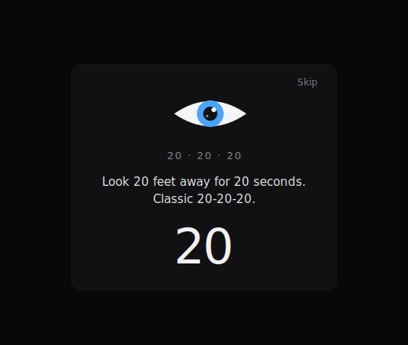
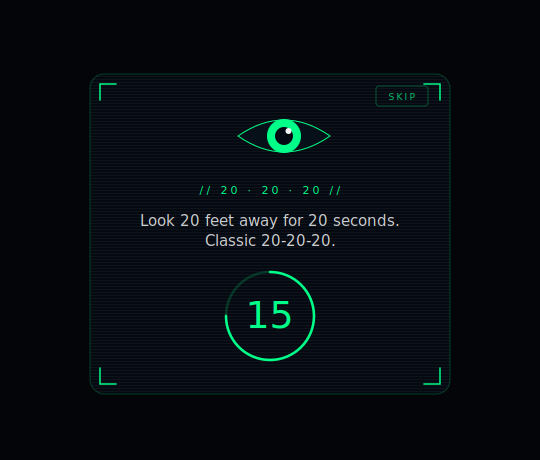

# Blink Reminder

A tiny menu-bar macOS app that gently (and sometimes sassily) reminds you to rest your eyes following the **20-20-20 rule**: every 20 minutes, look at something 20 feet away for 20 seconds.

No main window. Just a tray icon, a global shortcut, and a break popup that dims the screen, counts down, and gets out of the way.

---

## Preview

Two themes, switchable from the tray menu:

<table>
  <tr>
    <td align="center">
      
      <br/>
      <sub><b>Minimal</b> — soft dark, friendly blue-iris eye</sub>
    </td>
    <td align="center">
      
      <br/>
      <sub><b>HUD</b> — neon-green terminal with a draining ring</sub>
    </td>
  </tr>
</table>

Both popups open with an eye-open scaleY animation, dim the screen behind them, play a soft chime, and show a different reminder message each time.

---

## Features

- **Menu-bar only** — no dock icon, no main window
- **Break popup on every connected display**, centered on each workArea
- **Screen dim overlay** during the break (click-through, multi-monitor)
- **Audible chime** on break open (macOS Glass sound)
- **Configurable reminder interval** — presets (5 / 10 / 20 min) plus a "Custom…" dialog accepting any value up to 120 min
- **Configurable break duration** — 20 / 30 / 60 sec
- **Two popup themes** — Minimal (soft dark) or HUD (neon-green terminal)
- **22 rotating reminder messages**, a mix of informative and sassy, randomized and never repeating consecutively
- **Snooze** — 15 min / 30 min / 1 hour with auto-resume
- **Global keyboard shortcuts**:
  - `⌘ ⌥ B` — toggle reminders on/off (or resume from snooze)
  - `⌘ ⌥ ⇧ B` — fire an instant break
- **Persistent settings** — interval, break duration, and theme survive restarts
- **Running / paused tray icons** (open eye vs. slashed eye)

---

## Install

### From source

Requires Node 18+ and npm.

```bash
git clone <this-repo-url> blink-reminder
cd blink-reminder
npm install
npm run make
```

The packaged `.app` lands at:

```
out/Blink Reminder-darwin-arm64/Blink Reminder.app
```

Drag it to `/Applications` and launch. First launch may show a Gatekeeper warning because the app is ad-hoc signed (not Apple-notarized). To open anyway:

> **Right-click** `Blink Reminder.app` → **Open** → confirm in the dialog.

You only need to do this once per machine.

### Running in dev

```bash
npm start
```

Dev mode uses a 10-second reminder interval so you can iterate fast.

---

## Usage

Click the tray icon (the eye) to open the menu:

- **Start reminders** / **Stop reminders** — toggle the interval timer
- **Snooze** → 15 min / 30 min / 1 hour (auto-resumes)
- **Reminder interval** → preset or Custom…
- **Break duration** → 20 / 30 / 60 sec
- **Popup theme** → Minimal / HUD
- **Show test break** — fire a break right now

Or use the keyboard shortcuts from anywhere:

| Shortcut      | Action                                  |
| ------------- | --------------------------------------- |
| `⌘ ⌥ B`      | Toggle reminders (start / stop / resume) |
| `⌘ ⌥ ⇧ B`    | Show a break immediately                 |

Settings persist to:

```
~/Library/Application Support/Blink Reminder/settings.json
```

Delete that file to reset everything to defaults (20 min / 20 sec / HUD).

---

## Tech

- **Electron 41** + **Electron Forge 7** + **Vite** (main-process build only)
- Plain JavaScript, single source file (`src/main.js`)
- Break popup HTML built as inline data URLs; two builder functions for the two themes
- Multi-display support via `screen.getAllDisplays()` — one popup and one dim overlay per display
- Tray icons are rasterized from SVGs via `rsvg-convert` into 18×18 + 36×36 PNG template images
- Custom-interval input uses `osascript -e 'display dialog …'` (no preload / IPC required)
- macOS packaged builds are ad-hoc signed in a `postPackage` hook so notifications and LaunchServices behave

This is a macOS-only app in practice — it uses `afplay`, `osascript`, `codesign`, and macOS-specific system sound paths. Cross-platform support would need about 1–2 hours of rewiring.

---

## Acknowledgements

- The **20-20-20 rule** is recommended by the American Academy of Ophthalmology for reducing digital eye strain.
- Tray icon and the animated in-popup eye are hand-drawn SVGs.
- Break chime uses macOS's built-in `Glass.aiff`.

---

## License

MIT
